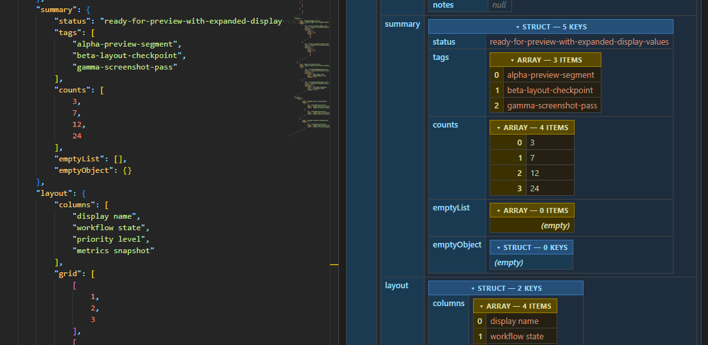

# JSON Dump

JSON Dump visualizes raw JSON as an interactive dump view inspired by `cfdump`. Open a `.json` document and inspect nested data in a dedicated webview with collapsible tables and switchable key ordering.

## Features

- Open valid `.json` documents directly from Explorer, the active editor tab, or the Command Palette.
- Renders `struct` and `arrays` as nested tables.
- Collapse or expand nested structures from the header row or the key column.
- Toggle between natural key order and `Sort Keys A->Z` from the editor title while the dump panel is active.
- Keeps scalar values easy to scan with distinct colors for strings, numbers, booleans, and nulls.

## Usage

1. Open a `.json` document with `JSON Dump` directly from the file explorer, or
2. With a JSON document open, run `JSON Dump` from the editor title menu, or the Command Palette while that document is active.
3. The viewer opens in a new tab.
4. Explore nested nodes in the webview, collapse or expand nodes by clicking their key columns or headers.
5. Use `Sort Keys A->Z` or `Natural Key Order` in the editor title while the dump panel is active.

## Changelog

Release notes are included with the extension changelog.